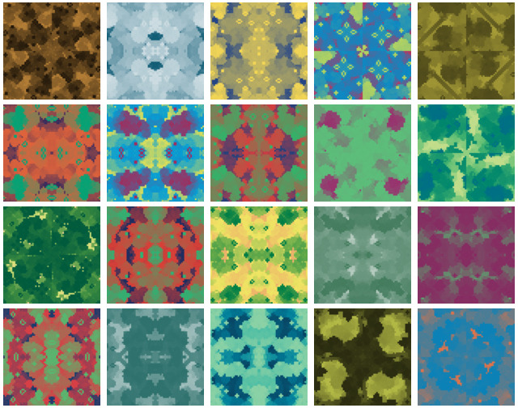

# LifeHash

🟨🟨🟨🟨🟨 
🟨🟨🟦🟨🟨 
🟨🟨🟨🟦🟨 
🟨🟦🟦🟦🟨 
🟨🟨🟨🟨🟨 

**© 2020 Blockchain Commons**

Original Author: [Wolf McNally](https://github.com/wolfmcnally)

---

Watch the LifeHash explainer video!

LifeHash is a method of hash visualization based on Conway’s Game of Life that creates beautiful icons that are deterministic, yet distinct and unique given the input data.

The basic concept is to take a SHA256 hash of the input data (which can be any data including another hash) and then use the 256-bit digest as a 16x16 pixel "seed" for running the cellular automata known as [Conway’s Game of Life](https://en.wikipedia.org/wiki/Conway's_Game_of_Life).

After the pattern becomes stable (or begins repeating) the resulting history is used to compile a grayscale image of all the states from the first to last generation. Using Game of Life provides visual structure to the resulting image, even though it was seeded with entropy.

Some bits of the initial hash are then used to deterministically apply symmetry and color to the icon to add beauty and quick recognizability.

#### LifeHashTool Command Line Tool

[LifeHashTool](https://github.com/BlockchainCommons/LifeHashTool) is a command line tool written in Swift that generates LifeHash images as PNG files.

### 🆕 New in Version 6!

Hot on the heels of version 5 comes version 6! The `.original` version has been renamed `.version1` and `.version2` has been introduced. `.version2` fixes a gradient scaling bug. Furthermore, `.version2` and `.fiducial` LifeHashes now also a CMYK-friendly palette that presents better in print, and in many cases looks less-garish on-screen. The LifeHash generation API still defaults to `.version1`, so you need do nothing if you're alreadying using it: you must opt-in to the other versions. Nonetheless, LifeHash `.version1` is now **DEPRECATED**, so if you're starting a new project, I recommend you pick one of the other styles.

#### LifeHashes In Five Flavors

* **`version1`** The Original. **DEPRECATED**
* **`version2`** Bug fixes and CMYK-friendly.
* **`detailed`** Now with twice the resolution, and CMYK-friendly.
* **`fiducial`** [Fiducials](https://en.wikipedia.org/wiki/Fiducial_marker#Fiducial_marker_sets) are symbols specifically optimized for recognition by machine vision algorithms like those in Apple's [ARKit](https://developer.apple.com/augmented-reality/arkit/). Now CMYK-friendly.
* **`grayscaleFiducial`** Highest contrast for low-light situations.

⚠️ **NOTE:** The images generated by LifeHash from a given seed will not be recognizably similar between each of these versions. So pick the one you want to use for your application and stick with it!

##### Version 1 (DEPRECATED)

##### Version 2

##### Detailed

##### Fiducial

##### Grayscale Fiducial

### From the "LifeHash Example" demo app:

"LifeHash Example" lets you scroll through an endless table of LifeHashes generated from sequential integers, and tap on any of them to get a closer look. The selector at the top lets you choose to browse `.version2`, `.detailed`, `.fiducial`, and `.grayscaleFiducial` LifeHashes.

 

### From the "LifeHash Gallery" demo app:

"LifeHash Gallery" shows an elegant, artistic presentation of various collections of LifeHashes that automatically change every ten seconds. The latest version shows `.version2`, `.detailed`, and `.fiducial` LifeHashes.

### From the Mathematica implementation:

⚠️ **NOTE:** The Mathematica implementation currently only generates `version1` LifeHashes.

 

## Tips for Presenting LifeHash Images

* Don't vignette or round the corners of a LifeHash image, every pixel contributes to the security of the image, so show the image as a square. If you *really* want to round the corners, make the radius small enough to still show the corner pixels.
* Don't interpolate or blur a LifeHash image: show every pixel crisply. On iOS UIKit this is accomplished by setting `layer.magnificationFilter = .nearest` on a `UIImageView`. Under SwiftUI you call `myImage.interpolation(.none)`. The iOS LifeHash library already does this for you.
* The iOS/Mac LifeHash library renders LifeHash images asynchronously and caches the result, so if you pass in the same Fingerprint you'll get the same image back right away. But if LifeHash rendering seems slow, be sure you're compiling the Release configuration of your target: LifeHash is *really fast* when compiled for Release.

## Platforms

LifeHash is currently available through Swift Package Manager and as a Mathematica (Wolfram Language) notebook.

## License

LifeHash is available under the BSD-2-Clause license. See [LICENSE.md](./LICENSE.md) for more info.

## Financial Support

LifeHash is a project of [Blockchain Commons](https://www.blockchaincommons.com/). We are proudly a "not-for-profit" social benefit corporation committed to open source & open development. Our work is funded entirely by donations and collaborative partnerships with people like you. Every contribution will be spent on building open tools, technologies, and techniques that sustain and advance blockchain and internet security infrastructure and promote an open web.

To financially support further development of LifeHash and other projects, please consider becoming a Patron of Blockchain Commons through ongoing monthly patronage as a [GitHub Sponsor](https://github.com/sponsors/BlockchainCommons). You can also support Blockchain Commons with bitcoins at our [BTCPay Server](https://btcpay.blockchaincommons.com/).

## Contributing

We encourage public contributions through issues and pull-requests! Please review [CONTRIBUTING.md](./CONTRIBUTING.md) for details on our development process. All contributions to this repository require a GPG signed [Contributor License Agreement](./CLA.md).

### Discussions

The best place to talk about Blockchain Commons and its projects is in our GitHub Discussions areas.

[**Wallet Standard Discussions**](https://github.com/BlockchainCommons/AirgappedSigning/discussions). For standards and open-source developers who want to talk about wallet standards, please use the Discussions area of the [Airgapped Signing repo](https://github.com/BlockchainCommons/AirgappedSigning). This is where you can talk about projects like our [LetheKit](https://github.com/BlockchainCommons/bc-lethekit) and command line tools such as [seedtool](https://github.com/BlockchainCommons/bc-seedtool-cli), both of which are intended to testbed wallet technologies, plus the libraries that we've built to support your own deployment of wallet technology such as [bc-bip39](https://github.com/BlockchainCommons/bc-bip39), [bc-slip39](https://github.com/BlockchainCommons/bc-slip39), [bc-shamir](https://github.com/BlockchainCommons/bc-shamir), [Shamir Secret Key Recovery](https://github.com/BlockchainCommons/bc-sskr), [bc-ur](https://github.com/BlockchainCommons/bc-ur), and the [bc-crypto-base](https://github.com/BlockchainCommons/bc-crypto-base). If it's a wallet-focused technology or a more general discussion of wallet standards,discuss it here.

[**Blockchain Commons Discussions**](https://github.com/BlockchainCommons/Community/discussions). For developers, interns, and patrons of Blockchain Commons, please use the discussions area of the [Community repo](https://github.com/BlockchainCommons/Community) to talk about general Blockchain Commons issues, the intern program, or topics other than the [Gordian System](https://github.com/BlockchainCommons/Gordian/discussions) or the [wallet standards](https://github.com/BlockchainCommons/AirgappedSigning/discussions), each of which have their own discussion areas.

### Other Questions & Problems

As an open-source, open-development community, Blockchain Commons does not have the resources to provide direct support of our projects. Please consider the discussions area as a locale where you might get answers to questions. Alternatively, please use this repository's [issues](./issues) feature. Unfortunately, we can not make any promises on response time.

If your company requires support to use our projects, please feel free to contact us directly about options. We may be able to offer you a contract for support from one of our contributors, or we might be able to point you to another entity who can offer the contractual support that you need.

### Credits

The following people directly contributed to this repository. You can add your name here by getting involved — the first step is to learn how to contribute from our [CONTRIBUTING.md](./CONTRIBUTING.md) documentation.

| Name | Role | Github | Email | GPG Fingerprint |
|---|---|---|---|---|
| Wolf McNally | Originator, Project Lead | [@WolfMcNally](https://github.com/wolfmcnally) | \<Wolf@WolfMcNally.com\> | 9436 52EE 3844 1760 C3DC  3536 4B6C 2FCF 8947 80AE |
| Christopher Allen | Principal Architect | [@ChristopherA](https://github.com/ChristopherA) | \<ChristopherA@LifeWithAlacrity.com\> | FDFE 14A5 4ECB 30FC 5D22  74EF F8D3 6C91 3574 05ED |

## Responsible Disclosure

We want to keep all our software safe for everyone. If you have discovered a security vulnerability, we appreciate your help in disclosing it to us in a responsible manner. We are unfortunately not able to offer bug bounties at this time.

We do ask that you offer us good faith and use best efforts not to leak information or harm any user, their data, or our developer community. Please give us a reasonable amount of time to fix the issue before you publish it. Do not defraud our users or us in the process of discovery. We promise not to bring legal action against researchers who point out a problem provided they do their best to follow the these guidelines.

## Reporting a Vulnerability

Please report suspected security vulnerabilities in private via email to ChristopherA@BlockchainCommons.com (do not use this email for support). Please do NOT create publicly viewable issues for suspected security vulnerabilities.

The following keys may be used to communicate sensitive information to developers:

| Name              | Fingerprint                                        |
| ----------------- | -------------------------------------------------- |
| Christopher Allen | FDFE 14A5 4ECB 30FC 5D22  74EF F8D3 6C91 3574 05ED |

You can import a key by running the following command with that individual’s fingerprint: `gpg --recv-keys "<fingerprint>"` Ensure that you put quotes around fingerprints that contain spaces.
